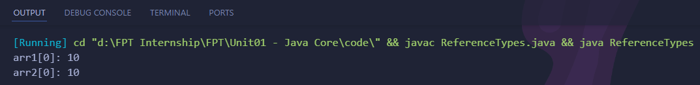

### Assignment 1
Compare Value types and reference types. Explain and example.
#
### Value types
Value types are stored directly in memory and hold their values within their own memory space. They are essentially a copy of the original value, and any changes made to the copy do not affect the original value. Examples of value types include primitive data types like integers, characters, and booleans.

#### Example :
```java
public class ValueTypes {
    public static void main(String[] args) {
        int num1 = 10;
        int num2 = num1;

        num2 = 20;

        System.out.println("num1: " + num1);
        System.out.println("num2: " + num2);
    }
}
```

In this example, num1 and num2 are value types (primitive data types). When num2 is assigned the value of num1, a copy of the value is made. Therefore, modifying num2 does not affect the original value of num1.

#
### Reference Types
Reference types, on the other hand, store memory addresses that point to complex objects or data structures stored elsewhere in memory. They are essentially pointers to the actual objects. When a reference type is assigned to another reference type, both variables point to the same object in memory. Changes made to the object through one reference affect the original object.

#### Example :
```java
public class ReferenceTypes{
    public static void main(String[] args) {
        int[] arr1 = {1, 2, 3};
        int[] arr2 = arr1;

        arr2[0] = 10;

        System.out.println("arr1[0]: " + arr1[0]); 
        System.out.println("arr2[0]: " + arr2[0]);
    }
}
```

In this example, arr1 and arr2 are reference types. When arr2 is assigned to arr1, both variables reference the same array object in memory. Therefore, modifying the array through arr2 also affects the original array referenced by arr1.

#
### Differences
- Value types store their values directly in memory, while reference types store memory addresses that point to the actual data.
- When a value type is assigned to another value type, a copy of the value is made. When a reference type is assigned to another reference type, both variables point to the same object.
- Changes made to a value type do not affect the original value. Changes made to a reference type affect the original object.