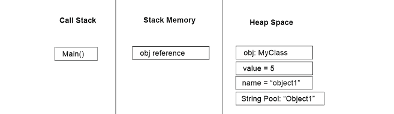
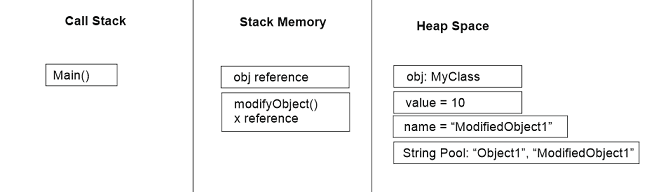
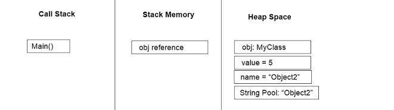
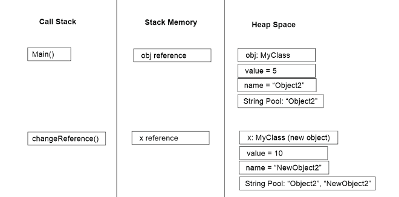

### Assignment 6
Explain previous slice as slice 6 (stack & heap).

#
## **Code 1 : Passing Object Reference to a Method**
```java
public class Code1 {
    public static void main(String[] args) {
        MyClass obj = new MyClass();
        obj.value = 5;
        obj.name = "Object1";
        modifyObject(obj);
        System.out.println("obj.value after modifyObject: " + obj.value);
        System.out.println("obj.name after modifyObject: " + obj.name);
    }

    public static void modifyObject(MyClass x) {
        x.value = 10;
        x.name = "ModifiedObject1";
    }
}

class MyClass {
    int value;
    String name;
}
```
In this code, the main method begins by creating an instance of MyClass called obj and assigns initial values to its value and name properties. This object is allocated in the heap memory, with a reference to it stored in the stack frame for the main method. When modifyObject is called with obj as the argument, a new stack frame for this method is created, and x, the parameter, points to the same heap object as obj. Inside modifyObject, x.value and x.name are modified, which directly changes the obj object in the heap. Consequently, when control returns to the main method, the changes made to obj are still present, leading to the output showing the updated values of value and name as 10 and "ModifiedObject1", respectively. This demonstrates how passing a reference to a method in Java allows that method to alter the actual object in the heap.

#
#### Before Calling "modifyObject"


The main method initializes obj in the heap. The string "Object1" is stored in the String Pool, and obj.name references it.
#
#### After Calling "modifyObject"


After modifyObject: The modifyObject method changes obj.value to 10 and obj.name to point to "ModifiedObject1", which is added to the String Pool.

#
## **Code 2 : Changing Reference to a New Object**
```java
public class Code2 {
    public static void main(String[] args) {
        MyClass obj = new MyClass();
        obj.value = 5;
        obj.name = "Object2";
        changeReference(obj);
        System.out.println("obj.value after changeReference: " + obj.value);
        System.out.println("obj.name after changeReference: " + obj.name);
    }

    public static void changeReference(MyClass x) {
        x = new MyClass();
        x.value = 10;
        x.name = "NewObject2";
    }
}

class MyClass {
    int value;
    String name; 
}
```
In this code, a similar sequence begins with the creation of a MyClass instance named obj and initialization of its properties in the main method. This object resides in the heap, with obj as a reference to it in the stack. However, the behavior diverges when changeReference is called. Here, a new stack frame is created, and x, the parameter, initially points to the same object as obj. Within changeReference, x is assigned a new instance of MyClass, which is allocated in the heap. This new object has its value and name properties set to 10 and "NewObject2". However, this change only affects the local reference x within the method. The original obj reference in the main method still points to the initial heap object, which remains unmodified. Thus, when main resumes, it prints the unchanged values of obj.value and obj.name as 5 and "Object2", respectively. This highlights how reassigning a local reference inside a method does not alter the original object reference outside that method, as only the local reference x is updated to point to the new object, while obj continues to point to the original object.

#
#### Before Calling "changeReference"


Initial State: The main method initializes obj in the heap. The string "Object2" is stored in the String Pool, and obj.name references it.

#
#### After Calling "changeReference"


After changeReference: The changeReference method assigns a new MyClass object to x, which has a value of 10 and name "NewObject2". This new string is added to the String Pool, but obj retains its original values.

#
In Code1, modifications to the object via x affect the object that obj references, demonstrating that both x and obj point to the same heap object. In Code2, x is reassigned to a new object within the method, which does not impact the original object that obj references, highlighting that changes to local references do not affect the references outside the method.