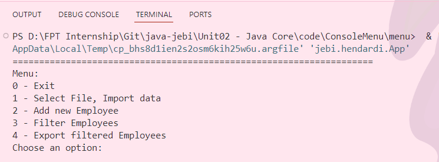
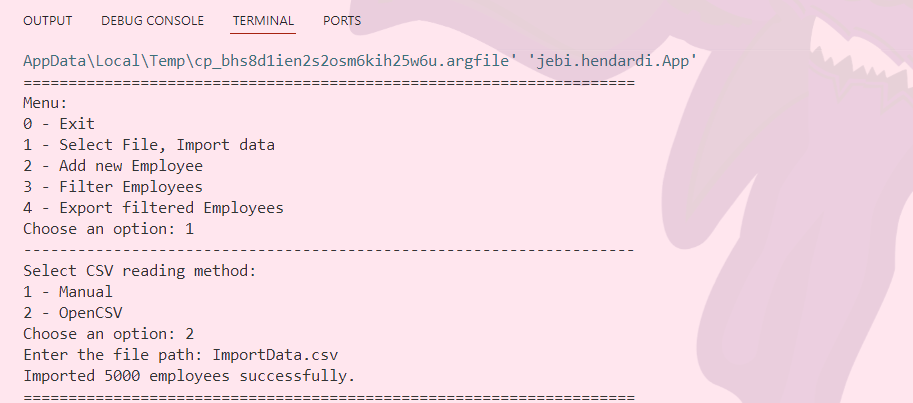
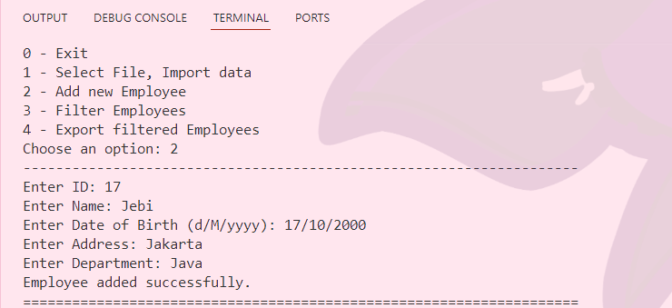
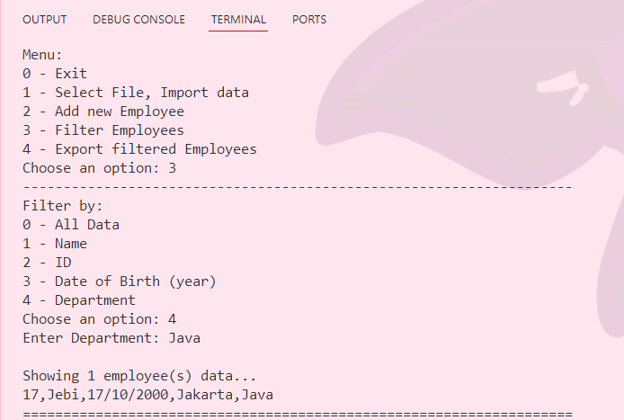
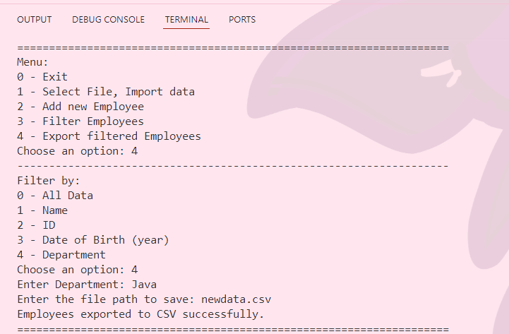
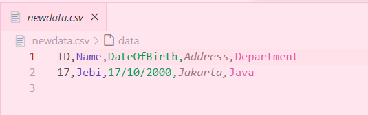

### Assignment 7
Console Menu. Menu input from keyboard:
- 0 - break
- 1 - Select file, import data;
- 2 - Add new Employee
- 3 - Filter by name (like), id (like), dobirth – year (equal), department (equal);
- 4 - Filter and export to csv file, order by Dobirth;
#
**Source Coude** : https://github.com/affandyfandy/java-jebi/tree/main/Unit02%20-%20Java%20Core/code/ConsoleMenu/menu
#
### Project Structure
```
menu
├── src/main/java/jebi/hendardi
│   ├── App.java
│   ├── control/
│   │   └── AppManager.java
│   ├── entity/
│   │   └── Employee.java
│   └── utils/
│       ├── DateUtils.java
│       └── FileUtils.java
└── pom.xml
```
#
### Define Dependency OpenCSV and Lombok in pom.xml
```
<dependency>
    <groupId>com.opencsv</groupId>
    <artifactId>opencsv</artifactId>
    <version>5.9</version>
</dependency>

<dependency>
    <groupId>org.projectlombok</groupId>
    <artifactId>lombok</artifactId>
    <version>1.18.32</version>
    <scope>provided</scope>
</dependency>
```
#
### AppManager Class
Manages the application flow, including menu display, user input handling, and interaction with Employee data.
| Method                    | Description                                                                                                                       |
|---------------------------|-----------------------------------------------------------------------------------------------------------------------------------|
| **start()**                | Starts the application and displays a menu for various operations like importing, adding, filtering, and exporting employee data. |
| **importData()**             | Imports employee data from CSV files using either manual parsing or the OpenCSV library based on user choice                      |
| **addEmployee()**            | Allows users to add new employees with attributes such as ID, name, date of birth, address, and department                        |
| **filterEmployees()**         | Filters employees based on user-specified criteria such as name, ID, birth year, or department                                    |
| **printFilteredEmployees()** | Displays filtered employee data to the console.                                                                                   |
| **exportFilteredEmployees()**| Exports filtered employee data to a CSV file.                                                                                     |

#
### Employee Class
Represents an employee with attributes like ID, name, date of birth, address, and department. Have method **toCSV()** to Converts employee data into a CSV format string for exporting

#
### DateUtils Class
Provides utility methods for parsing date strings into LocalDate objects. Have method **parseDate(String dateStr)** to Parses a date string in the format "d/M/yyyy" into a LocalDate object.
#
## FileUtils Class
Handles file operations related to employee data, including reading from CSV (both manual and using OpenCSV) and writing to CSV.
| Method                                               | Description                                                    |
|------------------------------------------------------|----------------------------------------------------------------|
| **readEmployeesFromCSVManual(String filePath)**         | Reads employee data from a CSV file using manual parsing.      |
| **readEmployeesFromCSVOpenCSV(String filePath)**         | Reads employee data from a CSV file using the OpenCSV library. |
| **writeEmployeesToCSV(List employees, String filePath)** | Writes a list of employees to a CSV file.                      |

#
### App Run


#
### Select file and Import Data


#
### Add new Employee


#
### Filter Data


#
### Filter and Export Data to csv


#
### New CSV File
